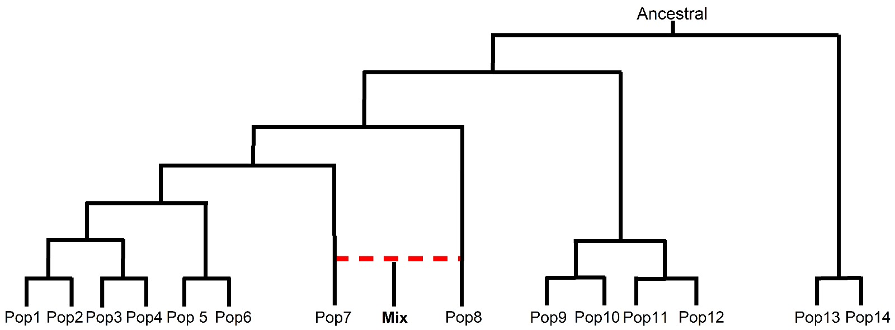
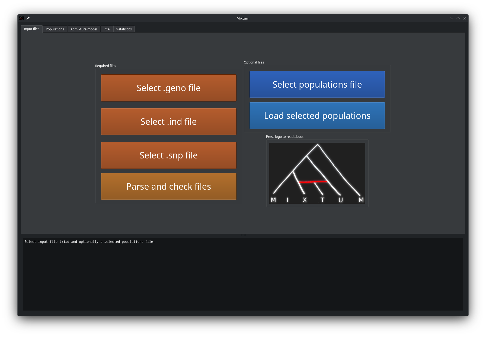
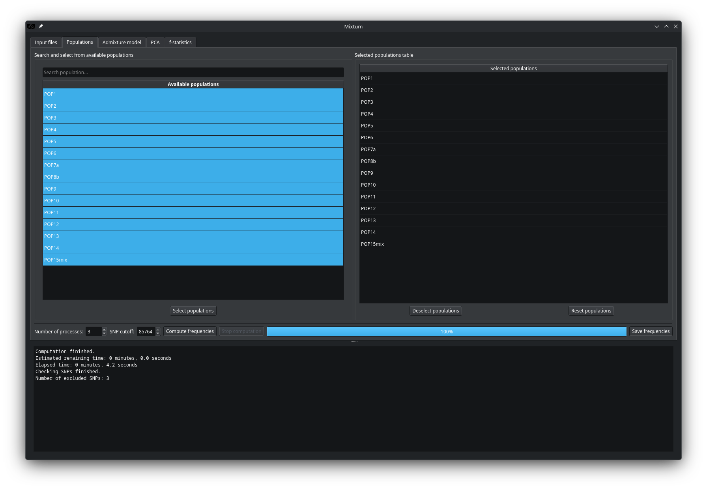
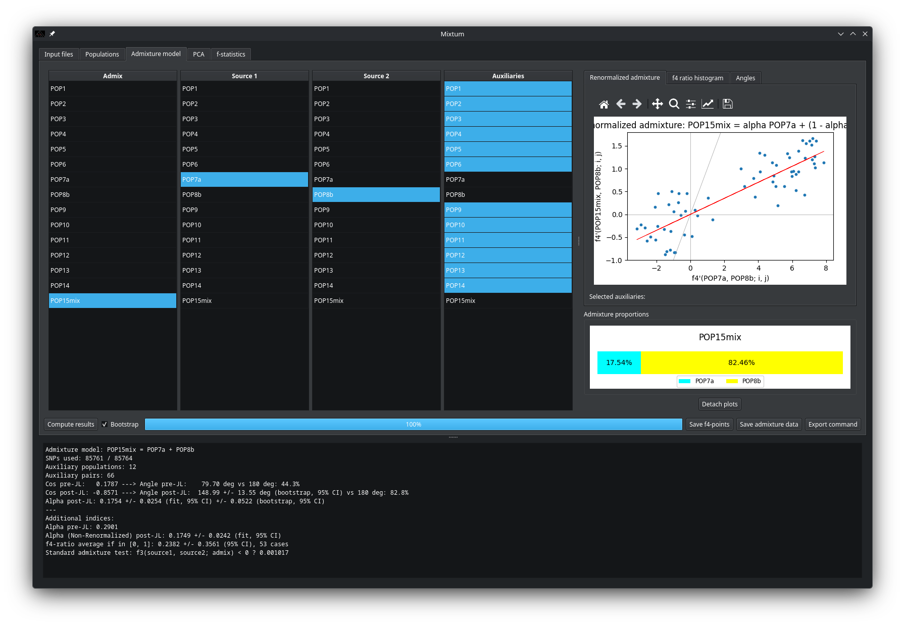
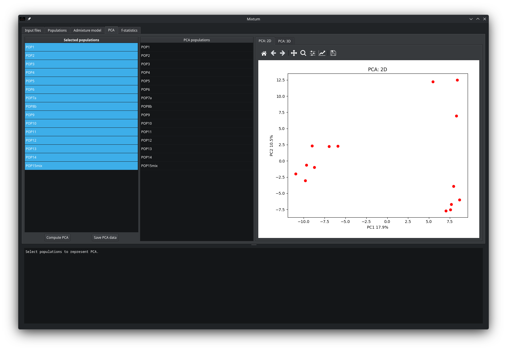
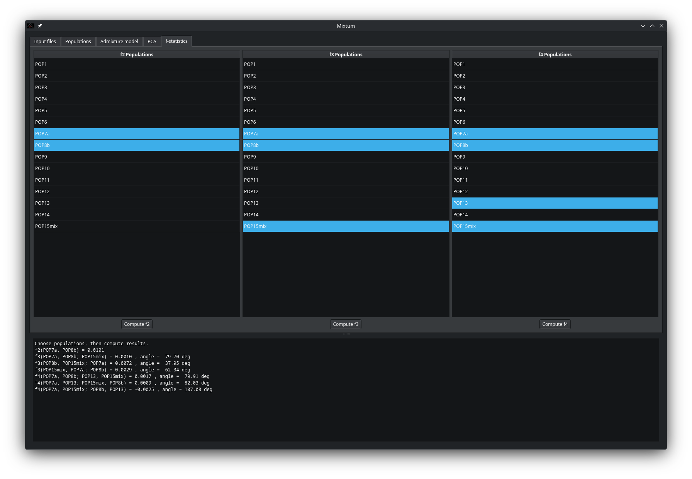

# How to MIXTUM? A practical example to the GUI

Given a phylogeny of 15 different populations simulated via msprime demography modelling we will explore the case of Pop15 (Mix). The divergence times in phylogeny are quite deep so branches are quite differentiated. The mixing proportions of Pop15 were simulated. It is as product of admixture between Pop7 contributing 20% (alpha) and Pop8 contributing 80% of the ancestry (1-alpha).

## Input files selection

Launch Mixtum GUI from your terminal:

    python mixtum_gui.py

You will be welcomed with a tab that looks like the following after launching the GUI: 

Here you can select your triad of files. We will use those available within the `datasets` directory. Once you have selected all three, press "Parse and check files". If the structure of the files is valid you should read "Checking finished" and "Parsed input files seem to have a valid structure" on the log below. It will also inform you about the number of lines in each file which in turn informs you of how many SNPs you have (.snp & .geno should match) and number of individuals (.ind) in the dataset.

## Populations selection

On the next tab you are able to select the populations where the individuals are grouped into:

Select the desired populations (all of them in our case, clicking on them or with the shortcut `CTRL+A`), and press "Select populations". They now should appear on the right panel. If you now click "Compute frequencies", Mixtum will calculate the allele frequencies for the selected populations. Position with high degree of missingness in one population will cause that SNP to be excluded in all downstream analyses. Selected populations are dynamic, you can add or removed populations at will to suit your needs and optimise number of SNPs. In this case, the dataset has near zero missing data. Number of processes used for parallel allele frequency calculations can be specified. 

## Admixture model

Next tab is the admixture model step:

This is the main feature and purpose of Mixtum. Here you can choose the target population (admix), the two donors (source 1 will always be considered for the alpha value), and the auxiliary populations. After pressing the "Compute results" button, the results will be displayed on the log below, which you can save them to disk. On a detachable section, several plots are available: renormalized admixture, f4-ratio histogram and angles. On the fit plot, you can identify which pair of auxiliary populations corresponds to each point by clicking on a point. 

Also, to replicate the calculations with the command-line script version of Mixtum, you can press the "Export command" button, which will save the populations used to a file, and the analogous command to a text file which you can open to copy and paste to your terminal.

## PCA

Next tab allows to compute PCA and plot them in 2D and 3D with the populations of choice:

You can identify which population corresponds to each point clicking on a point, or selecting populations from the "PCA populations" table, since PCA plots and this table are linked.

## $f$-statistics

On the f-statistics tab you can compute f2, f3 and f4 tests with selected populations. Press the `CTRL` key and click on the rows of the table for multiple selection. The results should appear on the log below. 

